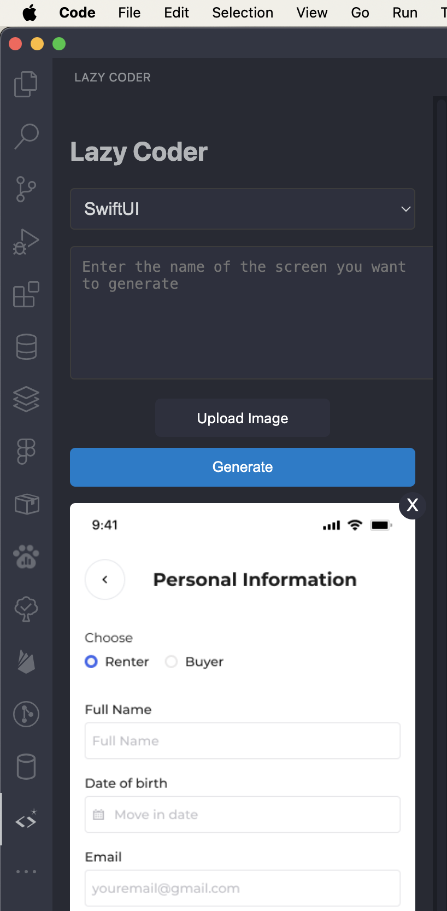

# Lazy Coder VS Code Extension

Lazy Coder is a VS Code extension that uses the Gemini AI to generate code based on text prompts and optional image inputs.

## Features

- Generate code using text prompts
- Include images in your prompts for more context
- Insert generated code directly into your active editor

## Requirements

- VS Code 1.74.0 or higher
- Gemini API Key

## Installation

1. Install the extension from the VS Code Marketplace.
2. Reload VS Code.
3. You will be prompted to enter your Gemini API Key on the first use.

## Usage

1. Open the command palette (`Ctrl+Shift+P`).
2. Run the "Open Lazy Coder Panel" command.
3. Enter your prompt and optionally upload an image.
4. Click "Generate" to generate code.
5. The generated code will be inserted at your cursor position in the active editor.

## How to Get a Gemini API Key

1. Go to the [Gemini API website](https://aistudio.google.com/app/apikey).
2. Sign up for an account or log in if you already have one.
3. Navigate to the **API Keys** section in your account dashboard.
4. Generate a new API key by clicking "Create New Key."
5. Copy the API key and use it in the extension settings.

## Extension Settings

This extension contributes the following settings:

- `lazyCoder.apiKey`: Your Gemini API Key.

## Known Issues

- List any known issues here.

## Release Notes

### 1.0.3

- Bug Fixes - Issues with API key configuration solved

---

## For more information

- [Visual Studio Code's Markdown Support](http://code.visualstudio.com/docs/languages/markdown)
- [Markdown Syntax Reference](https://help.github.com/articles/markdown-basics/)

**Enjoy!**

Author: Richard Kweku Aikins  
GitHub: [https://github.com/richprince23](https://github.com/richprince23)
